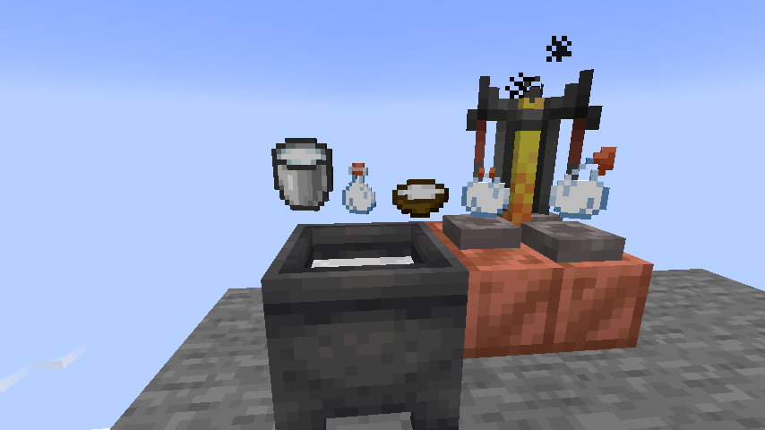

# Milk+
Milk+ is a Fabric mod for Minecraft that adds new interactions with milk.
# Features
- Milk buckets can be placed. They will be placed when looking at a block and not crouching, otherwise they will be drank.
- Standing in fluid milk removes all status effects as if you drank it.
- Fluid milk will grow dripstone, and dripstone with milk above it will fill cauldrons.
- Milk can be put into cauldrons. 
  - Milk bottles can be made by removing milk from a cauldron using glass bottles. Milk bottles remove 1 random status effect when drank.
    - Milk bottles can be brewed into lingering and splash milk bottles in the same way as any other potion. They clear all status effects.
  - Dyable items will be dyed white when used on a milk cauldron.
- Milk tipped arrows. Lingering milk bottle surrounded by arrows, or use arrows on a milk cauldron.
- Milk soup. Does the same thing as a milk bottle. Milk bottle + bowl.

Milk demonstration: https://youtu.be/bZMMxfK0Fu8

